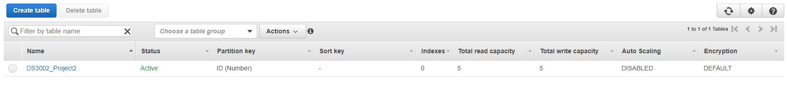
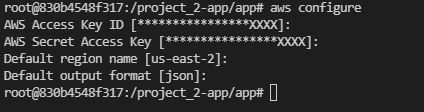
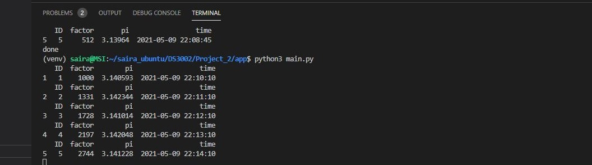
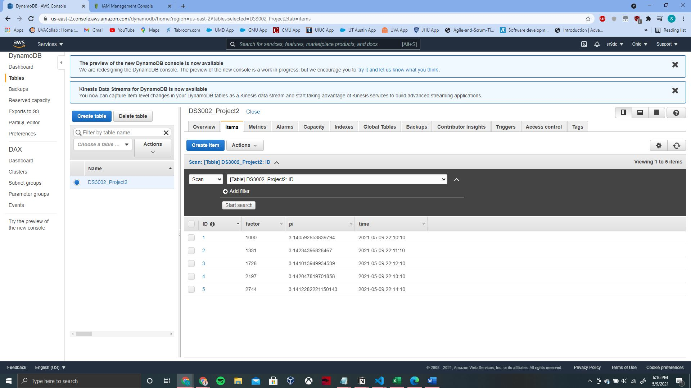
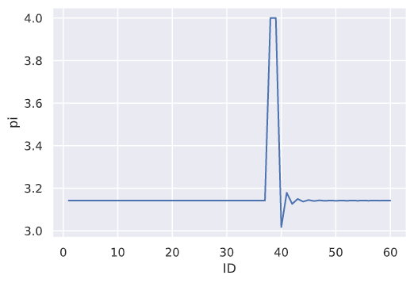
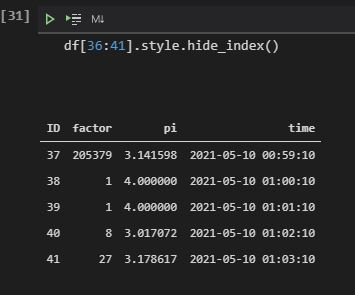
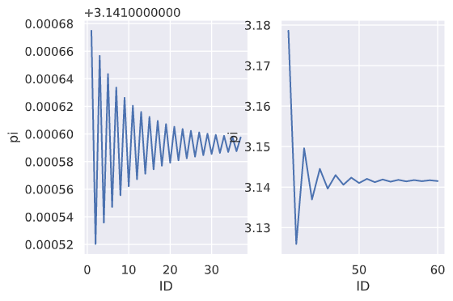
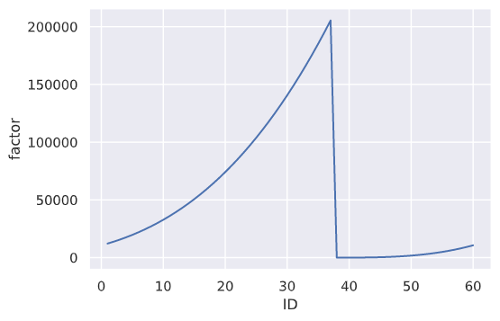
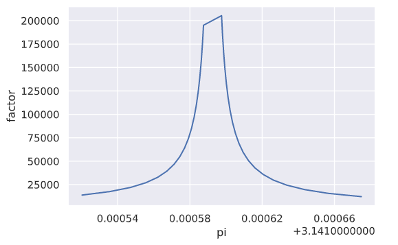

# Data Ingestion & Analysis Project
<!-- 
*** Thanks for checking out my Data Ingestion & Analysis Project. If you have a suggestion
*** that would make this better, please fork the repo and create a pull request
*** or simply open an issue with the tag "enhancement".
-->

## Built With

* [Python](https://www.python.org/)
* [Amazon DynamoDB](https://aws.amazon.com/dynamodb/)
* [Packages](https://github.com/sr9dc/DS_Systems_Project_2/blob/master/requirements.txt) (See `requirements.txt`)
* [Docker](https://www.docker.com/)
* [Jupyter](https://jupyter.org/)

<!-- GETTING STARTED -->
## About

* The project executes and deploys a process that executes exactly once every minute, retrieving data from a [remote API](https://4feaquhyai.execute-api.us-east-1.amazonaws.com/api/pi) and writing all retrieved values to a database for **60** minutes.  

* Code-based data analysis techniques are then used against the database to describe any patterns or changes in the data over time and to explain the logic of these changes.

* On the code end, the basic script can be run using Python and the AWS Command Line Interface (CLI) to connect to the database using an access key and it's corresponding secret access key.

* DynamoDB was the primary tool used as a way to write the values retrieved from the API to the NoSQL database. 

* The database values were then scraped using the `boto3` package in python, and an analysis was conducted using a Jupyter Notebook to observe any changes. 

* Finally, the `ubuntu` official Docker Image was created to containerize the project to help with deployment. 

<!-- GETTING STARTED -->
## Getting Started

The precursor to successfully using the script is [setting up a DynamoDB table](https://docs.aws.amazon.com/amazondynamodb/latest/developerguide/SampleData.CreateTables.html), along with [getting an AWS access key and secret access key](https://docs.aws.amazon.com/amazondynamodb/latest/developerguide/SettingUp.DynamoWebService.html) to access DynamoDB programmatically. Download the `.csv` file to make sure you do not lose the key. 

You should also probably [choose the IAM admin user and user group](https://docs.aws.amazon.com/IAM/latest/UserGuide/getting-started_create-admin-group.html) when you obtain the AWS access key. For the project, I allowed full administrator access, but you may choose what role you want depending on the table. 

Next, set up a table. To be able to run my script easily, the table name should be `DS3002_Project2` and the primary key should be named `ID`, which corresponds to the minute ID from 1-60 minutes. You may need to change these values in the program if they do not have the same name. The rest of the settings should be unaltered. 




Now, you can either `(1)` clone the [repository](https://github.com/sr9dc/DS_Systems_Project_2), or `(2)` pull from Docker Hub in the steps below. Keep in mind, you will have to install dependencies manually for the cloning option. Some more configuration will be required with docker, but the dependencies should be installed  pretty easily. <br /> <br />

Here are the docker instructions: 

```
docker pull sairajulad/python-lyricbot
```

Use the images command to list all your local images. Here you should see the pulled docker repository. 
```
docker images
```

Run the command below to enter into the shell. It must be run interactively.
```
docker run -it sairajulad/python-lyricbot
```
 <br /> 

Now, run the following command using the [AWS CLI](https://docs.aws.amazon.com/cli/latest/userguide/cli-configure-quickstart.html). Make sure to input the **AWS Access Key ID** and **Secret Access Key** you got from the creation of your DynamoDB database. Also, make sure the Default region name matches where your database is hosted (mine was *us-east-2*).

```
aws configure
```



Now, you should be able to run the python script easily. Make sure that the values are inputted correctly at each minute for **60** minutes into the DynamoDB database. 

```
python3 app/main.py
```

<!-- PROGRAM RUN -->
## An Actual Run

When the python script is run, the following output should be shown each minute. A `pandas` library dataframe was used to easily input into the DynamoDB database. The [dynamo-pandas](https://pypi.org/project/dynamo-pandas/) came in handy for this. 

Shown below are 5 frames inserted into the database (taken at around 5 minutes). The columns of interest are the `factor`, `pi`, and `time` columns. The `ID` column corresponds each minute out of **60**, and was useful for plotting. 



Here is the database at 5 minutes. 




As you can see, the values are being inputted correctly. The python script ensures that the code execution halts at the **60** minute mark. 

<!-- Analysis -->
## Analysis

Now, let's run a quick analysis on the patterns in the dataset. The Jupyter Notebook file is included in this repository if you'd like to have a closer look. 


Here, I plotted the minute `ID` vs. the `pi` value taken from the database. 



As you can see, there's a huge spike somewhere between **35-40** minute mark, let's observe the database data closer using the Jupyter Notebook code. 



Once the time hits **38** minutes (`ID`), the time marker is back at **0** minutes for the hour (`time`), which explains why the jump occurred. This probably means that the values ***reset at the 0 minute mark***. 

Now, let's plot values from **0-37** minutes, and then to **40-end** minutes to see the pattern better.



It looks like the `pi` value is iterating back and forth, almost like an average precise value is being reached.

 <br /> 

Now let's take a look at the `factor` variable. Here, I plotted the minute `ID` vs. the `factor` value taken from the database. 




It seems that the `factor` variable increases when the value reaches stability. Once the `pi` value hits **4.000000** during the hour reset (at `ID`  = 38), the `factor` value drops down.


 <br /> 

Let's look at it closer, now plotting the `pi` value vs. `factor`. I plotted this from `ID` = 0 to 37, because the factor value fluctuates heavily and skews the graph after the hour reset. 




It looks like the `factor` spikes up around a certain value of `pi` (which is definitely its true value).

<br /> 


Based on this analysis, the `factor` variable increases as the value of `pi` becomes certain. At around the **37th** minute, which corresponded to the end of the hour, the `factor` variable was at its maximum, and the `pi` value was at its most precise and accurate. The `factor` is highest when the value of `pi` reaches it actual value at **~3.1415926535**.

<!-- CONTRIBUTING -->
## Contributing

Contributions are what make the open source community such an amazing place to be learn, inspire, and create. Any contributions you make are **greatly appreciated**.

1. Fork the Project
2. Create your Feature Branch (`git checkout -b feature/AmazingFeature`)
3. Commit your Changes (`git commit -m 'Add some AmazingFeature'`)
4. Push to the Branch (`git push origin feature/AmazingFeature`)
5. Open a Pull Request

<!-- LICENSE -->
## License

Distributed under the MIT License. See `LICENSE` for more information.


<!-- CONTACT -->
## Contact

Sai Rajuladevi: https://www.linkedin.com/in/sai-rajuladevi/

Github Project Link: [https://github.com/sr9dc/DS_Systems_Project_1](https://github.com/sr9dc/DS_Systems_Project_1)

Dockerized Project Link: [https://hub.docker.com/r/sairajulad/python-lyricbot](https://hub.docker.com/r/sairajulad/python-lyricbot)
